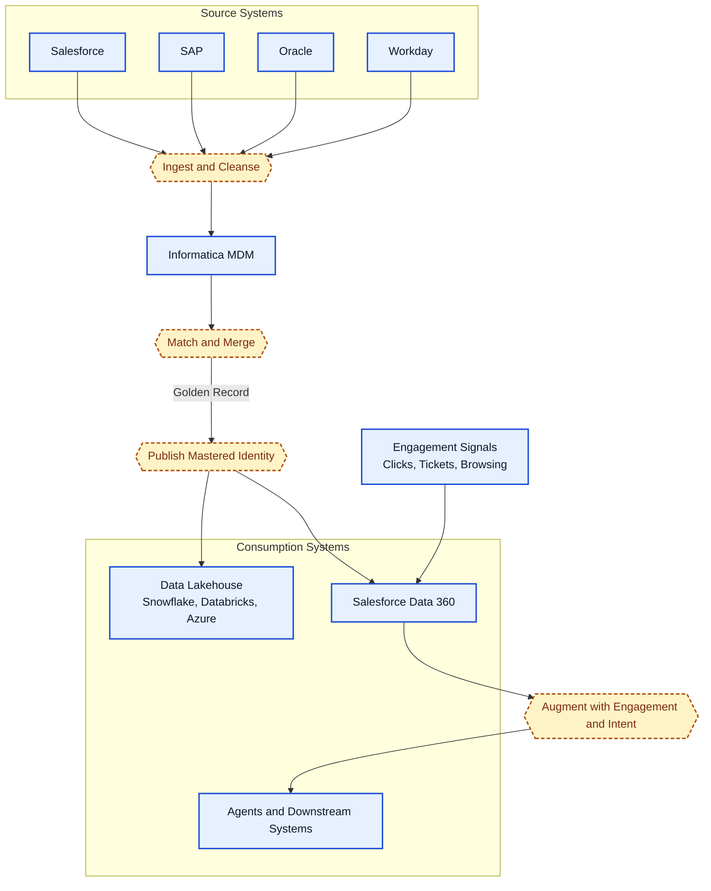

Architecting a modern data strategy requires moving away from the "either/or" debate between Master Data Management (MDM) and real-time activation. The real value lies in the synergy: utilizing both MDM Golden Record and high-velocity engagement signals.

Following recent deep dives at Salesforce TDX, the relationship between Informatica MDM and Salesforce Data 360 is becoming a clear architectural blueprint. Here is how these systems should work together to turn "Authoritative Truth" into "Real-Time Action."

## Informatica MDM: The Fuel (Authoritative Truth)

If you do not know who the customer is, you cannot effectively predict what they will do. Informatica MDM acts as the Trusted Data Foundation. It masters complex entities across front- and back-office systems (Salesforce, SAP, Workday, Oracle) to create a single, legally and operationally authoritative version of each business entity.

- **Validated Identity**: Records are verified against legal entities (DUNS, Tax IDs) rather than just being de-duplicated.
- **Trust Scores**: Source systems are ranked by attribute. For example, the system automatically prioritizes SAP for billing data while favoring Salesforce for contact preferences.
- **Hierarchy Management**: It models complex parent-child legal structures and account-to-contact relationships that standard CRM objects often struggle to maintain at scale.

## Data 360: The Engine (Real-Time Activation)

While MDM provides the fuel, Salesforce Data 360 is the activation engine. It consumes the Golden Record and overlays it with fast-moving, high-volume engagement signals.

- **Engagement Federation**: It ingests clicks, support tickets, and browsing patterns—data that moves too fast for traditional MDM workflows.
- **Propensity & Intent**: By anchoring these behavioral signals to the mastered identity, Data 360 generates accurate customer insights and predictive intent signals.
- **Data-Driven Workflow**: It powers personalization and autonomous agents across customer and employee channels using the "Trusted Context" provided by the MDM layer.

## The Architectural Pattern

From a technical standpoint, the flow follows a specific sequence to ensure data integrity without sacrificing speed:

1. **Preparation**: Data from sources like Salesforce, SAP, or Oracle is ingested, profiled, and cleansed.
2. **The Master**: Informatica performs the Match & Merge to produce the Golden Record.
3. **The Handshake**: The Golden Record is pushed into the Data Lakehouse (Snowflake, Databricks, Azure, etc.) and simultaneously into Data 360.
4. **Activation**: Data 360 takes the mastered identity from MDM and augments it with engagement signals and insights, making it ready for consumption by agents and other systems.

## Why This Matters for the Enterprise

We are no longer just building reports. We are building data-driven workflows.

- **Consistency:** Once the Golden Record is published, every downstream system, from ERP to Marketing Cloud, operates from the same truth.
- **Scalability:** By offloading identity resolution and hierarchy management to Informatica, Data 360 can focus on what it does best: enrichment and activation.

## Summary

The takeaway is simple: MDM should tell you who the customer is, while Data 360 should tell you how to talk to them. Informatica provides precision, Salesforce Data 360 provides speed and insights. Together they give access to the trusted context required to power the next generation of AI-driven customer experiences.