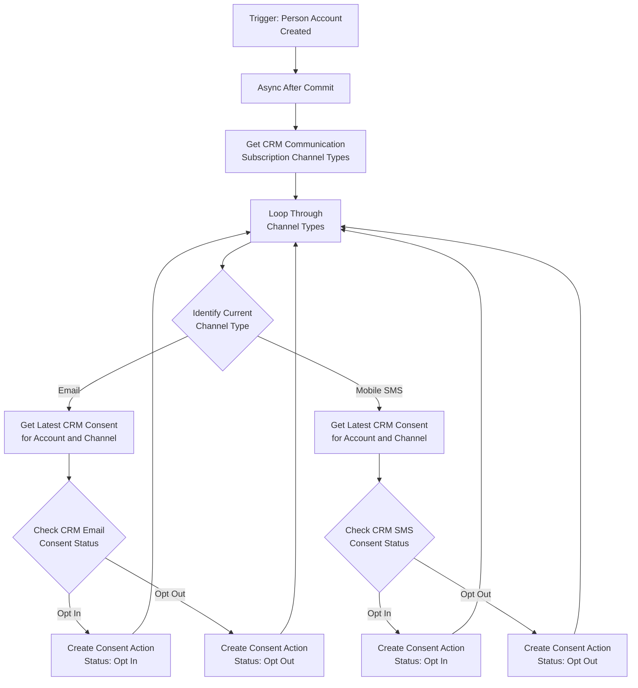
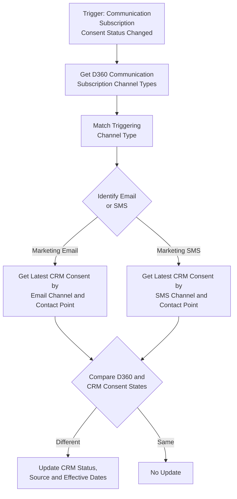
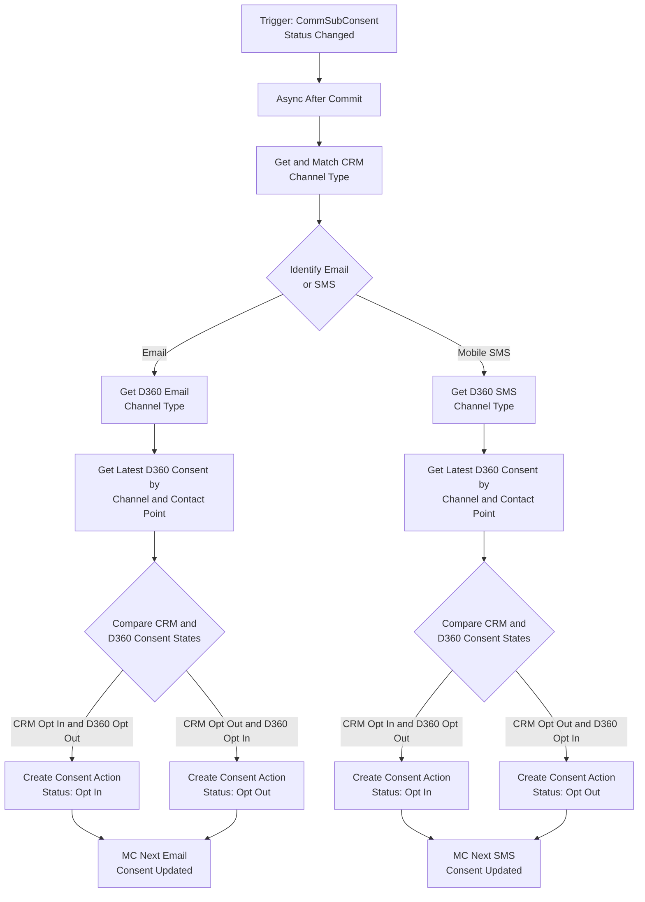

With the rollout of Marketing Cloud Next, Salesforce has fundamentally reimagined consent management. Consent is no longer an arbitrary text field or a checkbox on a Lead or Contact record. Instead, it is highly structured, multi-channel, and tightly bound to specific **Contact Points** (such as a unique email address or phone number) rather than the individual record itself.

Excellent conceptual overviews of this paradigm shift have already been highlighted by industry peers, notably François Perret in his [Consent Management Deep Dive](https://the-agentic-marketer.com/marketing-cloud-next-deep-dives/consent-management/) and Nobuyuki Watanabe in his [Guide to Consent Management](https://medium.com/@marketingcloudtips/marketing-cloud-on-core-a-guide-to-consent-management-5ca95a1602a0).

For e-commerce architectures where Salesforce CRM acts as the core transactional repository using the standard **Communication Subscription Consent (`CommSubscriptionConsent`)** object, maintaining a real-time, bi-directional sync with Data 360 and Marketing Cloud Next is critical.

Crucially, **traditional data integration methods will break your compliance**. This post details the strict rules of MC Next consent mechanics and outlines the 3-flow architecture required to keep your systems flawlessly in sync.

## The Golden Rule of MC Next Consent: Watch out for Unsupported Methods

Before configuring any synchronization, enterprise architects must understand a major architectural guardrail: **You cannot map external consent data directly into the Communication Subscription Consent DMO via data streams or batch data transforms.**

While the data may appear to save successfully in the DMO, MC Next will ignore it during message sends. This leads to critical compliance failures:

* **Silent Dropouts:** Emails may fail to send to fully opted-in addresses.
* **Compliance Violations:** Emails may be inadvertently sent to opted-out individuals because the transactional consent service did not register the change.
* **UI Misalignment:** The DMO data will mismatch the *Consent Status* component on individual records.

For the strict engineering definitions governing these behaviors, consult the official Salesforce documentation on [Understanding Consent Concepts in Marketing Cloud Next](https://help.salesforce.com/s/articleView?id=mktg.mktg_consent_tools_ref.htm&type=5) alongside the master checklist of [Marketing Cloud Next Supported Consent Actions](https://help.salesforce.com/s/articleView?id=005316463&type=1).

**The Solution:** Consent updates within MC Next must be executed via the native **Create Consent** flow action so that the transactional consent service registers the change. In the current release, Salesforce also supports this action in record-triggered flows, allowing changes to CRM records to update MC Next consent directly. See [Update Consent Data with the Create Consent Flow Action](https://help.salesforce.com/s/articleView?id=release-notes.rn_mktg_consent_flow_action.htm&release=264&type=5) for the release details.

## The 3-Flow Architecture for E-Commerce Consent Sync

To bridge Salesforce CRM, Data 360, and Marketing Cloud Next without breaking transactional logic, we deploy three specific flows.

### Flow 1: New Registration Automation (Record-Triggered)

**Trigger Scenario:** A new Person Account is created in Salesforce CRM. After the transaction commits, we need to inspect its channel-specific CRM consent records and establish the baseline MC Next consent state for its email and mobile contact points.

* **Flow Type:** Record-Triggered Flow with an asynchronous path
* **Trigger Object:** Account (`Account`)
* **Trigger Condition:** A record is created and `IsPersonAccount` equals `True`
* **Logic Steps:**
1. **Get Records (`Get CRM Communication Subscription Channel Types`):** Query all core CRM `CommSubscriptionChannelType` records after the Account transaction commits.
2. **Loop and Decision (`Identify the Current Channel Type`):** Iterate through the channel types and route records named `Email` or `Mobile SMS` to their channel-specific path.
3. **Get Records (`Get CRM Consent State`):** Query the latest core CRM `CommSubscriptionConsent` where `Consent Giver ID` equals the new Person Account ID and `Communication Subscription Channel Type ID` equals the current channel type.
4. **Decision (`Check CRM Consent State`):** Evaluate the retrieved `Privacy Consent Status` value.
* *Branch A (Opt In):* CRM consent status indicates active subscription acceptance.
* *Branch B (Opt Out):* CRM consent status indicates explicit non-consent.
5. **Action Branches:**
* *Path A (Opt In):* Execute the **Create Consent** action with *Consent Status* set to `OptIn`, the appropriate email or SMS subscription and channel configuration, and the Person Account's corresponding email address or mobile number as the contact point value.
* *Path B (Opt Out):* Execute the **Create Consent** action with *Consent Status* set to `OptOut` and the same channel-specific contact point and configuration.

### Flow 2: Reflect MC Next Preferences in CRM (Data Cloud-Triggered)

**Trigger Scenario:** A subscriber updates their preferences via an MC Next default preference page or clicks an unsubscribe URL in an email marketing campaign. This alters the consent state within MC Next, and we must push this downstream to the CRM.

* **Flow Type:** Data Cloud-Triggered Flow
* **Trigger Object:** Communication Subscription Consent (`ssot_CommunicationSubscriptionConsent__dlm`)
* **Trigger Condition:** A record is updated and `ssot__ConsentStatus__c` changes
* **Logic Steps:**
1. **Get and Filter Channel Types:** Query the Data 360 `ssot__CommunicationSubscriptionChannelType__dlm` records, select the record whose `ssot__Id__c` matches the triggering consent's channel type ID, and inspect its name.
2. **Decision (`Update CRM Consent for the Correct Channel Type`):** Route names beginning with `Marketing Email` or `Marketing SMS` to the corresponding CRM channel path.
3. **Get Records (`Get CRM Channel Type`):** Query the core `CommSubscriptionChannelType` named `Email` or `Mobile SMS`.
4. **Get Records (`Get CRM Consent State`):** Query the latest core `CommSubscriptionConsent` matching both the CRM channel type and the triggering DMO's contact point value.
5. **Decision (`Update CRM Consent State`):** Compare the Data 360 status values `OPT_IN` and `OPT_OUT` with the CRM values `OptIn` and `OptOut`. Continue only when the two systems disagree.
6. **Update Records Branches:**
* *If Data 360 is `OPT_IN`:* Set the matching CRM record's `PrivacyConsentStatus` to `OptIn`.
* *If Data 360 is `OPT_OUT`:* Set the matching CRM record's `PrivacyConsentStatus` to `OptOut`.
* *For either update:* Copy the captured timestamp into `ConsentCapturedDateTime` and `EffectiveFromDate`, set `ConsentCapturedSource` to `Marketing Cloud Next`, and set `EffectiveToDate` to 12 months after the captured timestamp.

### Flow 3: Reflect CRM Updates in MC Next (Record-Triggered)

**Trigger Scenario:** A customer service agent or an external API modifies a core CRM `CommSubscriptionConsent` record. This back-office shift must be forced upstream into the MC Next transactional framework.

* **Flow Type:** Record-Triggered Flow with an asynchronous path
* **Trigger Object:** Communication Subscription Consent (`CommSubscriptionConsent`)
* **Trigger Condition:** A record is updated and `PrivacyConsentStatus` changes
* **Logic Steps:**
1. **Get and Filter Channel Types:** Query all core CRM `CommSubscriptionChannelType` records, select the record whose ID matches the triggering consent's `CommSubscriptionChannelTypeId`, and inspect its name.
2. **Decision (`Update D360 Consent for the Correct Channel Type`):** Route `Email` and `Mobile SMS` to their channel-specific paths.
3. **Get Records (`Get D360 Channel Type`):** For email, query the Data 360 channel type whose name begins with `Marketing Email`. For SMS, use the equivalent `Marketing SMS` lookup.
4. **Get Records (`Get D360 Consent State`):** Query the latest `ssot__CommunicationSubscriptionConsent__dlm` record matching the selected Data 360 channel type and the triggering CRM record's `ContactPointValue__c`.
5. **Decision (`Update D360 Consent State`):** Compare CRM `OptIn` or `OptOut` with Data 360 `OPT_IN` or `OPT_OUT`. Invoke an action only when the states disagree.
6. **Action Branches:**
* *Path A (Consent Given):* For either email or SMS, execute the channel-specific **Create Consent** action with *Consent Status* set to `OptIn` and the triggering CRM record's `ContactPointValue__c`.
* *Path B (Consent Revoked):* For either email or SMS, execute the channel-specific **Create Consent** action with *Consent Status* set to `OptOut`. This tells the underlying transactional engine to suppress the contact point immediately.

## Technical Summary Matrix

| Flow Purpose | Flow Type | Starting Trigger Object | Core Action Element |
| --- | --- | --- | --- |
| **1. New Registration Baseline** | Record-Triggered, Async | `Account` (Person Account Created) | Native `Create Consent` (Action) |
| **2. MC Next --> CRM** | Data Cloud-Triggered | `ssot__CommunicationSubscriptionConsent__dlm` (Status Updated) | Standard `Update Records` (CRM Core) |
| **3. CRM --> MC Next** | Record-Triggered, Async | `CommSubscriptionConsent` (Status Updated) | Native `Create Consent` (Action) |

## Architect's Takeaway

When implementing Marketing Cloud Next alongside Data 360, treat consent data with the same strict governance as platform event streams. Do not rely on loose field mapping across data streams. By enforcing this 3-flow structural design pattern, you guarantee that your e-commerce platform remains completely aligned with global privacy frameworks (GDPR/CCPA), ensuring no message is lost—and more importantly, no opt-out is ignored.