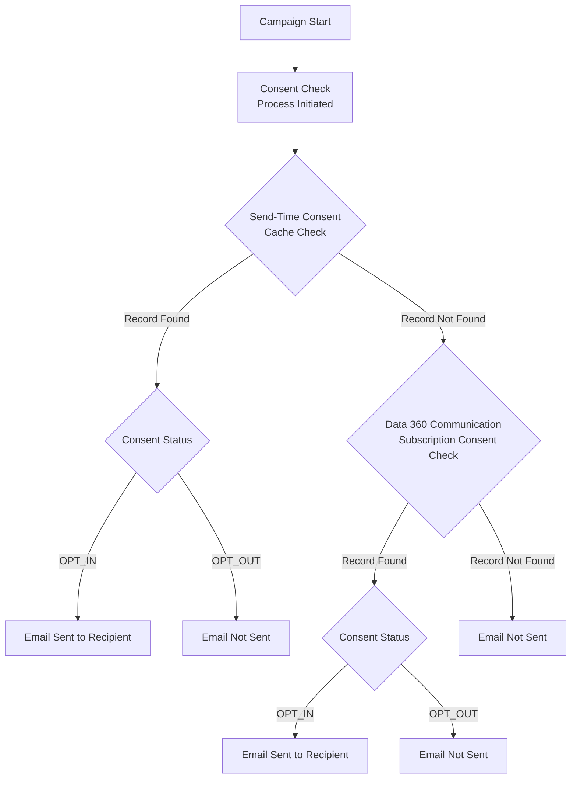
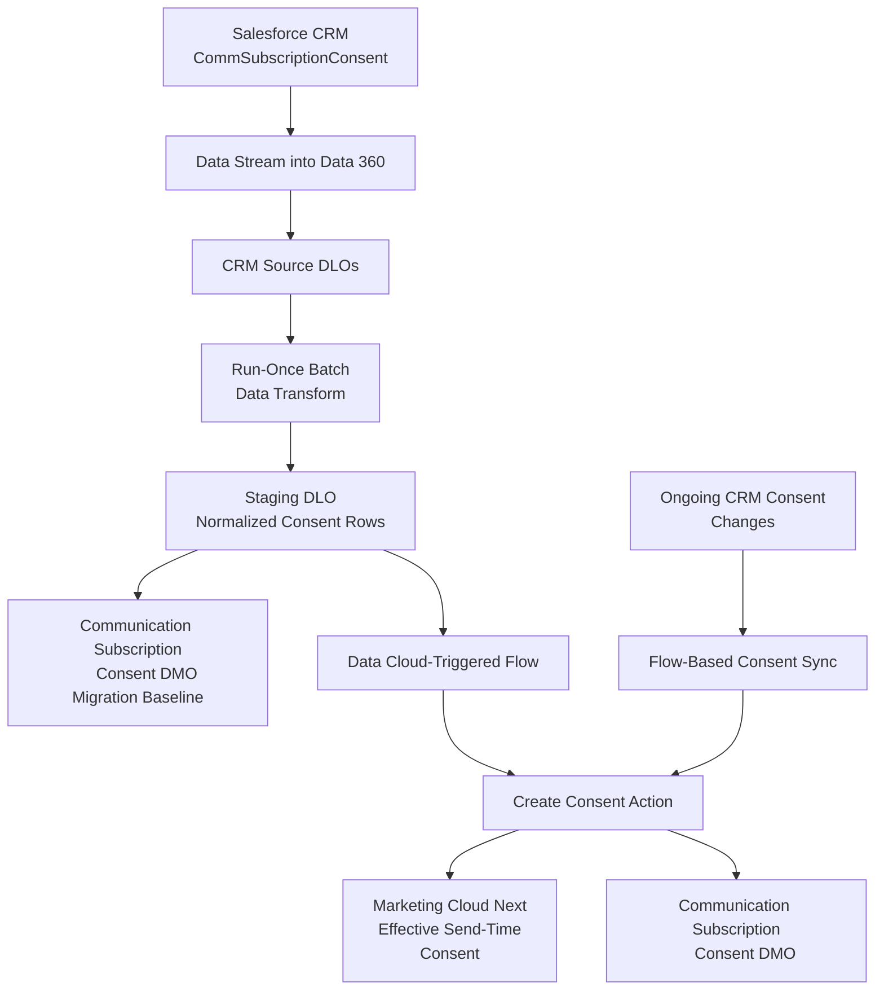

When Marketing Cloud Next is introduced into an existing Salesforce architecture, consent usually does not start from zero. There can already be years of opt-ins and opt-outs stored in CRM, often in the standard **Communication Subscription Consent (`CommSubscriptionConsent`)** object or in an implementation built around it.

The obvious migration idea is to ingest those records into Data 360, map them to the **Communication Subscription Consent DMO**, validate the row counts and move on.

Unfortunately, consent in Marketing Cloud Next is not quite that simple.

The difficult part is not moving the records. It is making sure that the consent visible in Data 360 is also the consent that Marketing Cloud Next will actually honour when a message is sent.

## The Problem: Visible Consent Is Not Always Send-Time Consent

Marketing Cloud Next stores consent in the Communication Subscription Consent DMO, but the send-time consent check has another important layer in front of it.

At a high level, the process can be represented like this:

The important point is the order of operations.

If Marketing Cloud Next already has an effective send-time consent state for the combination of contact point and subscription, that state can take precedence over the value currently visible in the Communication Subscription Consent DMO. The DMO is checked when no effective cached state is available.

This creates a scenario that is particularly dangerous during migrations: **the DMO can look correct while the message send behaves differently.**

For example, imagine that the DMO shows `OPT_OUT`, but the send-time state still reflects a previous `OPT_IN`. The data team can query the DMO, see an opt-out and reasonably assume that the person will be suppressed. The send-time check can still reach a different conclusion. The reverse situation is also possible: the DMO shows `OPT_IN`, while a stale opt-out state continues to suppress the recipient.

This is why consent migration should be treated as a cutover problem rather than a simple data-mapping exercise.

## Why This Happens with Data Streams and Batch Data Transforms

There are two very different ways to get consent-related data into Data 360.

The first is to write consent through one of the supported Marketing Cloud Next consent mechanisms, such as the native **Create Consent** action, consent import, preference pages or unsubscribe handling. These paths update the consent in the way Marketing Cloud Next expects it to be used at send time.

The second is to move rows through the Data 360 data layer: Data Streams, Data Lake Objects and Batch Data Transforms. Those mechanisms are excellent for ingesting and reshaping data, but writing a row into a DLO or making a value appear in the Communication Subscription Consent DMO is not, by itself, proof that the same state has been registered by the Marketing Cloud Next consent service.

That difference is what creates consent drift.

Salesforce now calls this out explicitly in its public guidance. For high-volume onboarding, the recommended pattern is to use a **Batch Data Transform to stage the consent rows** and then process those rows through a **Data Cloud-Triggered Flow using Create Consent** so that the consent is honoured at send time. Salesforce also warns against treating a Batch Data Transform that writes to a DLO mapped directly to the Communication Subscription Consent DMO as the final consent-write mechanism.

See the current Salesforce guidance in [Consent Management: Consent at Scale and Data Ingestion](https://help.salesforce.com/s/articleView?id=005389881&type=1) and [Consent Management: How Consent is Stored and Written](https://help.salesforce.com/s/articleView?id=005316463&type=1).

## Why We Still Need a Batch Data Transform for the Migration

None of this makes the Batch Data Transform unnecessary. Quite the opposite.

The source CRM model and the target Marketing Cloud Next consent model are not necessarily shaped the same way. A migration typically has to resolve the correct contact point, translate CRM consent statuses, map the record to the right Marketing Cloud Next communication subscription and channel, and determine which historical record represents the effective consent state.

Doing that transformation in a dedicated, **run-once Batch Data Transform** gives us a clean separation between the legacy CRM structure and the shape required by Marketing Cloud Next.

The migration architecture I would use looks like this:

The **staging DLO is the key design element**. It gives us somewhere to land the transformed migration dataset before we start changing the operational consent state.

If an implementation already maps that staging DLO to the Communication Subscription Consent DMO, I would treat that mapping as migration scaffolding and a reconciliation aid, not as the step that makes the consent operational. The migration is only complete after the same consent has been written through the supported Create Consent path.

That distinction matters because a direct DLO-to-DMO result can look perfectly correct in Data 360 while still not being the state used by the send-time consent check.

## Step 1: Ingest the CRM Consent Model into Data 360

The first step is to bring the CRM data needed for the migration into Data 360 through standard Data Streams.

At minimum, this normally includes the existing `CommSubscriptionConsent` records and enough related data to resolve the correct contact point, channel and communication subscription. Depending on the CRM model, that can also mean ingesting the related communication subscription channel types or the person/contact data used to derive the email address or phone number.

The goal at this stage is not to update Marketing Cloud Next consent. It is simply to make the source-of-truth CRM data available for transformation.

## Step 2: Normalize the Consent in a Run-Once Batch Data Transform

The Batch Data Transform should convert the CRM representation into one row per effective Marketing Cloud Next consent state.

A typical transformation looks like this:

| CRM / Source Concept | Staging Output | Transformation |
| --- | --- | --- |
| `PrivacyConsentStatus = OptIn` | `OPT_IN` | Normalize the CRM value to the Marketing Cloud Next consent value |
| `PrivacyConsentStatus = OptOut` | `OPT_OUT` | Normalize the CRM value to the Marketing Cloud Next consent value |
| Contact point / email / mobile | Contact Point Value | Resolve the actual address or number against which consent is checked |
| CRM channel and subscription references | MC Next subscription/channel references | Translate source identifiers to the target Marketing Cloud Next configuration |
| `ConsentCapturedDateTime` | Consent Captured Timestamp | Preserve the original consent timestamp where available |
| Multiple historical rows | One effective row | Select the current consent state for each contact point, subscription and channel |

This is also the right place to remove records that should not be migrated, resolve duplicates and make the dataset deterministic before anything reaches the operational consent layer.

The transform should be configured as a **migration-only job**. I would not schedule it as an ongoing process. Once the initial population has been generated and validated, the transform has done its job.

## Step 3: Land the Result in a Staging DLO

Writing the transformed output to a dedicated staging DLO gives us a checkpoint between source transformation and operational consent.

This is useful for a few reasons. We can compare source and target counts, inspect individual opt-ins and opt-outs, validate the communication subscription mapping and re-run the transformation during migration testing without automatically changing live send-time consent.

It also gives us a clean dataset that can trigger the supported Data Cloud consent-update process.

For a large migration, this staging layer is much easier to reason about than trying to combine ingestion, transformation and consent updates into one opaque operation.

## Step 4: Be Careful with Mapping the Staging DLO to the Consent DMO

It can be tempting to stop here: map the staging DLO to the Communication Subscription Consent DMO, confirm that the right values appear in Data 360 and declare the migration complete.

That is exactly where the cache problem can be missed.

A DLO-to-DMO mapping can give you the correct **visible** consent record without necessarily updating the **effective send-time** consent state. This can work in early testing when there has never been a previous consent interaction for the same contact point and subscription, because there may be no cached state to override the DMO. The same implementation can behave differently later, after a preference-page submission, unsubscribe, consent import or flow action has established an operational consent state.

So if the staging DLO is mapped to the Communication Subscription Consent DMO as part of the migration design, use that mapping for reconciliation and migration visibility only. Do not use it as the ongoing synchronization mechanism, and do not use DMO visibility as the sole acceptance criterion for the migration.

## Step 5: Register the Migrated State through Create Consent

The supported completion step is to process the staged rows through a **Data Cloud-Triggered Flow** that calls **Create Consent**.

That is the point at which the migration moves from "the data exists in Data 360" to "Marketing Cloud Next has registered this consent through the supported consent service path."

For large datasets, the staging DLO becomes the hand-off point: the Batch Data Transform does the heavy data-shaping work, while the flow performs the consent-specific write that Marketing Cloud Next expects.

This also gives us a much stronger validation model. Instead of asking only whether the DMO contains the right value, we can validate whether a known opted-in address is mailable and whether a known opted-out address is suppressed.

## Step 6: Cut Over from Migration Logic to Ongoing Consent Sync

The Batch Data Transform should not become a permanent consent synchronization job.

Once the migration is complete, ongoing CRM consent changes should move through the flow-based architecture described in my earlier post, [How to Keep Consent in Sync between Salesforce, Data 360 and Marketing Cloud Next](https://modrzejewski.it/blog/how-to-keep-consent-in-sync-between-salesforce-data-360-and-marketing-cloud-next/).

The important part of that architecture is that changes are no longer pushed into the consent DMO as generic data changes. A CRM consent update is translated into the native Create Consent operation, while changes originating in Marketing Cloud Next can be reflected back into the CRM consent model.

This creates a clear cutover boundary:

**Before cutover:** CRM data is ingested, transformed and staged for the one-time migration.

**At cutover:** staged consent is registered through the supported Create Consent path and validated at send time.

**After cutover:** the Batch Data Transform is no longer used for ongoing consent changes. Flow becomes the integration mechanism for consent updates.

That separation is what prevents a long-running data pipeline from competing with the Marketing Cloud Next consent service and slowly creating drift between the DMO and the effective send-time state.

## Migration Validation Checklist

Before campaigns start using the migrated population, I would validate all of the following:

1. The staging DLO contains the expected number of effective consent records after deduplication and filtering.
2. `OptIn` and `OptOut` values from CRM have been converted to the expected `OPT_IN` and `OPT_OUT` states.
3. Every migrated row resolves to the intended contact point, communication subscription and channel.
4. Known test records show the expected state in the Communication Subscription Consent DMO.
5. The same test records behave correctly in a real consent check: an opted-in contact can receive the message and an opted-out contact is suppressed.
6. The migration Batch Data Transform has no recurring schedule after cutover.
7. A new consent change made in CRM is handled by the ongoing flow and reaches Marketing Cloud Next through Create Consent.
8. A consent change made through a Marketing Cloud Next preference page or unsubscribe path is reflected back into CRM where bi-directional synchronization is required.

## The Anti-Pattern to Avoid

The most dangerous design is a hybrid that never really finishes migrating.

In that model, a Batch Data Transform keeps writing consent into a DLO mapped to the Communication Subscription Consent DMO while preference pages, unsubscribe links and flows also update consent through native Marketing Cloud Next mechanisms.

Now two write paths are maintaining the same logical consent state, but only one of them is guaranteed to update the send-time consent service. That is exactly how the value visible in Data 360 and the value used for a campaign send can drift apart.

If a Batch Data Transform is part of the migration, give it an end date. Use it to create the initial normalized population, validate the result, complete the supported consent write and then retire it from the ongoing consent architecture.

## Architect's Takeaway

Consent migration into Marketing Cloud Next is not a normal master-data migration. A row appearing in the Communication Subscription Consent DMO is necessary for visibility, but it is not enough to prove that Marketing Cloud Next will make the same decision at send time.

The safest pattern is to use Data 360 for what it is excellent at: ingesting the existing CRM consent model, transforming it once at scale and staging a clean target dataset. Then let the Marketing Cloud Next consent service do the final consent write through Create Consent, and hand all further changes over to the flow-based synchronization architecture.

That gives us a clean line between **migration** and **operations** and, more importantly, avoids the worst possible consent failure: a system that looks correct when queried but behaves differently when a message is actually sent.
