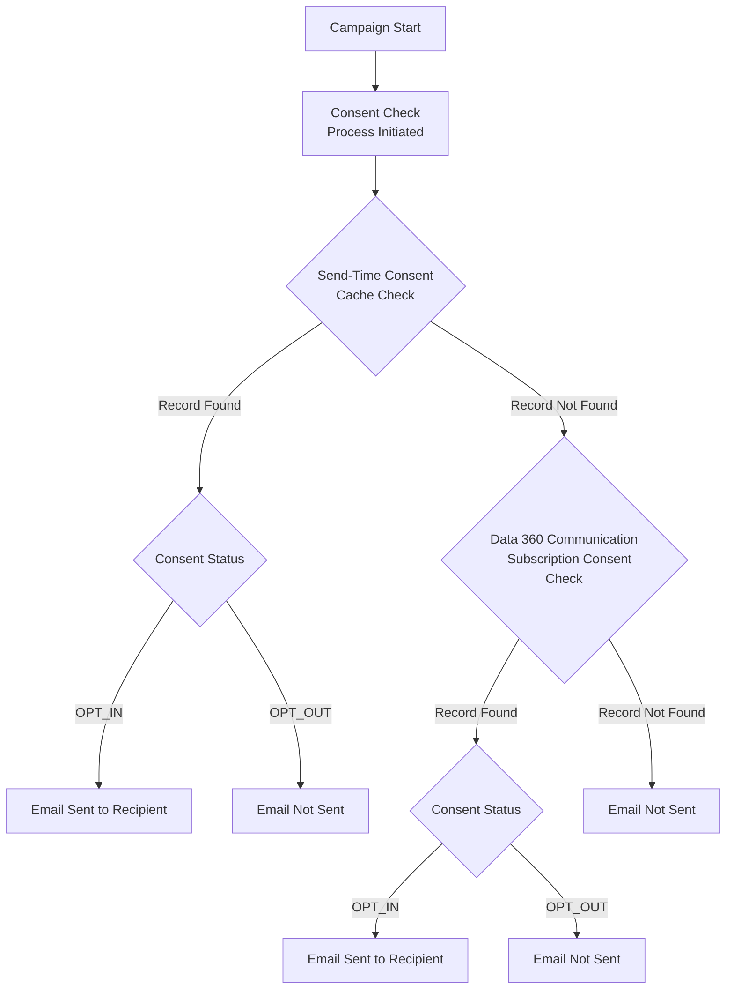
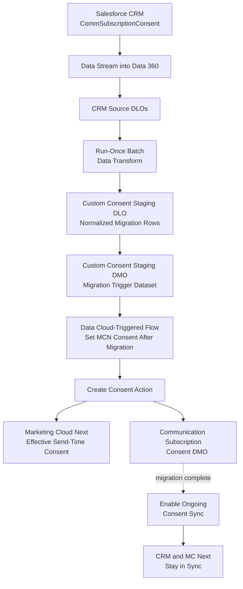
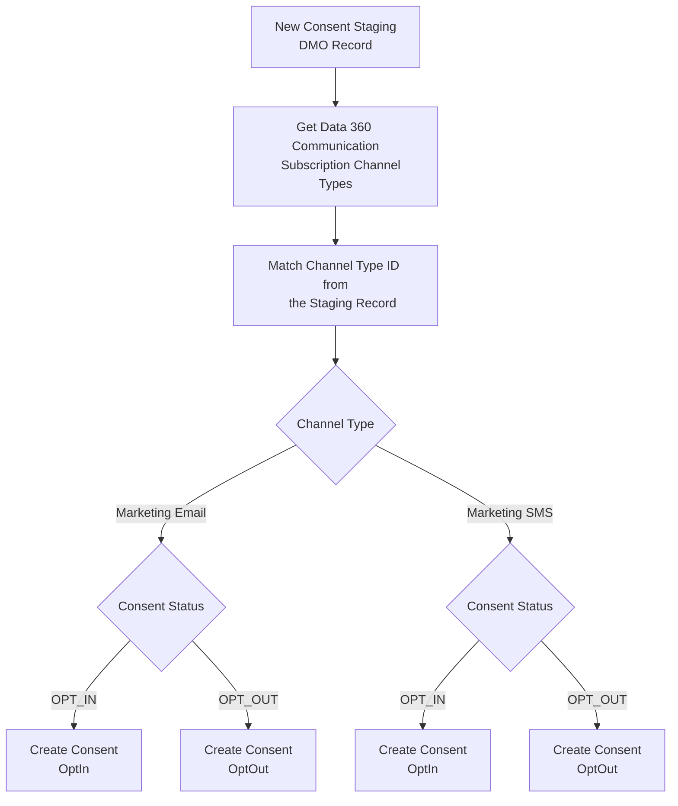
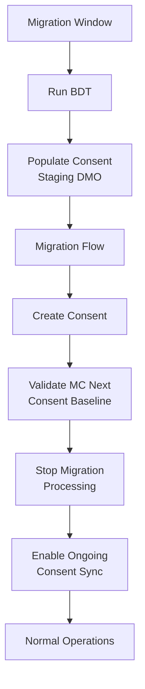

When Marketing Cloud Next is introduced into an existing Salesforce architecture, consent usually does not start from zero. There can already be years of opt-ins and opt-outs stored in CRM, often in the standard **Communication Subscription Consent (`CommSubscriptionConsent`)** object or in an implementation built around it.

The obvious migration idea is to ingest those records into Data 360, map them to the **Communication Subscription Consent DMO**, validate the row counts and move on.

Unfortunately, consent in Marketing Cloud Next is not quite that simple.

The difficult part is not moving the records. It is making sure that the consent visible in Data 360 is also the consent that Marketing Cloud Next will actually honour when a message is sent.

## The Problem: Visible Consent Is Not Always Send-Time Consent

Marketing Cloud Next stores consent in the Communication Subscription Consent DMO, but the send-time consent check has another important layer in front of it.

At a high level, the process can be represented like this:

The important point is the order of operations.

If Marketing Cloud Next already has an effective send-time consent state for the combination of contact point and subscription, that state can take precedence over the value currently visible in the Communication Subscription Consent DMO. The DMO is checked when no effective cached state is available.

This creates a scenario that is particularly dangerous during migrations: **the DMO can look correct while the message send behaves differently.**

For example, imagine that the DMO shows `OPT_OUT`, but the send-time state still reflects a previous `OPT_IN`. The data team can query the DMO, see an opt-out and reasonably assume that the person will be suppressed. The send-time check can still reach a different conclusion. The reverse situation is also possible: the DMO shows `OPT_IN`, while a stale opt-out state continues to suppress the recipient.

This is why consent migration should be treated as a cutover problem rather than a simple data-mapping exercise.

## Why This Happens with Data Streams and Batch Data Transforms

There are two very different ways to get consent-related data into Data 360.

The first is to write consent through one of the supported Marketing Cloud Next consent mechanisms, such as the native **Create Consent** action, consent import, preference pages or unsubscribe handling. These paths update the consent in the way Marketing Cloud Next expects it to be used at send time.

The second is to move rows through the Data 360 data layer: Data Streams, Data Lake Objects and Batch Data Transforms. Those mechanisms are excellent for ingesting and reshaping data, but writing a row into a DLO or making a value appear in the Communication Subscription Consent DMO is not, by itself, proof that the same state has been registered by the Marketing Cloud Next consent service.

That difference is what creates consent drift.

Salesforce now calls this out explicitly in its public guidance. For high-volume onboarding, the recommended pattern is to use a **Batch Data Transform to stage the consent rows** and then process those rows through a **Data Cloud-Triggered Flow using Create Consent** so that the consent is honoured at send time. Salesforce also warns against treating a Batch Data Transform that writes to a DLO mapped directly to the Communication Subscription Consent DMO as the final consent-write mechanism.

See the current Salesforce guidance in [Consent Management: Consent at Scale and Data Ingestion](https://help.salesforce.com/s/articleView?id=005389881&type=1) and [Consent Management: How Consent is Stored and Written](https://help.salesforce.com/s/articleView?id=005316463&type=1).

## Why We Still Need a Batch Data Transform for the Migration

None of this makes the Batch Data Transform unnecessary. Quite the opposite.

The source CRM model and the target Marketing Cloud Next consent model are not necessarily shaped the same way. A migration typically has to resolve the correct contact point, translate CRM consent statuses, map the record to the right Marketing Cloud Next communication subscription and channel, and determine which historical record represents the effective consent state.

Doing that transformation in a dedicated, **run-once Batch Data Transform** gives us a clean separation between the legacy CRM structure and the shape required by Marketing Cloud Next.

The architecture I now use adds one important isolation layer: the Batch Data Transform writes to a **custom Consent Staging DLO**, which is mapped to a **custom Consent Staging DMO**. That custom DMO, rather than the real Communication Subscription Consent DMO, triggers the migration flow.

The important difference is what is **not** in this diagram: there is no direct mapping from the migration staging DLO to the standard Communication Subscription Consent DMO.

The staging objects exist only to prepare and hand off the initial population. The actual Marketing Cloud Next consent is created through **Create Consent**, so the same supported path establishes both the operational consent state and the record that ultimately appears in the Communication Subscription Consent DMO.

## Why a Custom Staging DMO Makes the Design Cleaner

A staging DLO on its own is useful for inspection and reconciliation, but a Data Cloud-Triggered Flow needs a DMO change to react to. Mapping the migration output into a small custom staging DMO gives the migration a clean event boundary without contaminating the operational consent model.

That separation has several advantages:

* **The staging dataset is clearly migration-only.** It can contain the normalized contact point, target channel, subscription reference, consent status and source identifiers without pretending to be operational consent.
* **The standard Communication Subscription Consent DMO is written only through Create Consent.** There is no temporary or competing DLO-to-DMO consent write that can disagree with the send-time state.
* **The migration flow has an unambiguous trigger.** A new row in the custom staging DMO means: process this migrated consent through the native consent mechanism.
* **The ongoing consent-sync flow remains separate.** It can continue to work with the real Communication Subscription Consent DMO after migration, without also being the mechanism that performs the bulk migration.

This is especially important when you already have bi-directional consent synchronization. If the migration DLO were mapped directly to the Communication Subscription Consent DMO, the ongoing DMO-triggered synchronization flow could react to migration writes before those writes had gone through Create Consent. The custom staging DMO removes that ambiguity.

## Step 1: Ingest the CRM Consent Model into Data 360

The first step is to bring the CRM data needed for the migration into Data 360 through standard Data Streams.

At minimum, this normally includes the existing `CommSubscriptionConsent` records and enough related data to resolve the correct contact point, channel and communication subscription. Depending on the CRM model, that can also mean ingesting the related communication subscription channel types or the person/contact data used to derive the email address or phone number.

The goal at this stage is not to update Marketing Cloud Next consent. It is simply to make the source-of-truth CRM data available for transformation.

## Step 2: Normalize the Consent in a Run-Once Batch Data Transform

The Batch Data Transform should convert the CRM representation into one row per effective Marketing Cloud Next consent state.

A typical transformation looks like this:

| CRM / Source Concept | Staging Output | Transformation |
| --- | --- | --- |
| `PrivacyConsentStatus = OptIn` | `OPT_IN` | Normalize the CRM value to the Marketing Cloud Next consent value |
| `PrivacyConsentStatus = OptOut` | `OPT_OUT` | Normalize the CRM value to the Marketing Cloud Next consent value |
| Contact point / email / mobile | Contact Point Value | Resolve the actual address or number against which consent is checked |
| CRM channel and subscription references | MC Next subscription/channel references | Translate source identifiers to the target Marketing Cloud Next configuration |
| `ConsentCapturedDateTime` | Consent Captured Timestamp | Preserve the original consent timestamp where available |
| Multiple historical rows | One effective row | Select the current consent state for each contact point, subscription and channel |

This is also the right place to remove records that should not be migrated, resolve duplicates and make the dataset deterministic before anything reaches the operational consent layer.

The transform should be configured as a **migration-only job**. I would not schedule it as an ongoing process. Once the initial population has been generated and validated, the transform has done its job.

## Step 3: Write to a Custom Consent Staging DLO and DMO

The output of the Batch Data Transform should land in a dedicated **Consent Staging DLO**. That DLO is then mapped to a dedicated **Consent Staging DMO** created specifically for the migration.

The staging DMO should contain only what the migration flow needs. The key fields are the contact point value, the normalized consent status and the Communication Subscription Channel Type reference. Additional source IDs or migration-batch fields can be useful for reconciliation and troubleshooting.

The purpose of this DMO is very different from the standard Communication Subscription Consent DMO. It is not a second consent source of truth. It is a controlled queue of normalized migration records waiting to be registered through Marketing Cloud Next's supported consent mechanism.

This also gives us a very clear checkpoint. Before invoking Create Consent at scale, we can validate counts, inspect `OPT_IN` and `OPT_OUT` distributions, verify contact points and check that the channel references resolve to the expected Marketing Cloud Next configuration.

## Step 4: Trigger the Migration Flow from the Staging DMO

The custom Consent Staging DMO triggers a dedicated **Data Cloud-Triggered Flow** when a staging record is created. This migration-only flow is responsible for translating each staged consent row into the corresponding native **Create Consent** operation.

The flow does not write directly to the Communication Subscription Consent DMO. Instead, it resolves the target channel and invokes the native **Create Consent** action.

The logic is approximately:

The flow retrieves the Data 360 Communication Subscription Channel Types, matches the staging record's channel type ID and branches based on whether the record belongs to `Marketing Email` or `Marketing SMS`. For both channels, `OPT_IN` and `OPT_OUT` are translated into the corresponding `OptIn` and `OptOut` values and passed to **Create Consent** together with the staged contact point value and the appropriate subscription and channel configuration.

This is an important architectural boundary: **the custom staging DMO triggers the migration, but Create Consent performs the consent write.** The staging DMO never becomes the operational consent store.

## Step 5: Validate the Result in the Real Consent Model

After Create Consent has processed the staged population, the resulting consent should appear in the standard **Communication Subscription Consent DMO** and, more importantly, Marketing Cloud Next should have the corresponding effective send-time consent state.

That is the point at which the migration moves from "the source data was transformed successfully" to "Marketing Cloud Next has actually registered the consent through the supported path."

Validation should therefore happen at two levels:

* **Data validation:** the expected consent records appear in the Communication Subscription Consent DMO with the correct contact point, channel, subscription and status.
* **Behaviour validation:** known opted-in test records can receive the intended communication and known opted-out records are suppressed.

Do not treat the staging DMO as proof of a successful migration. It proves only that the source transformation completed. The real acceptance point is the operational consent created through Create Consent.

## Step 6: Finish the Migration, Then Immediately Turn On Ongoing Consent Sync

This sequencing is important.

**First populate the Marketing Cloud Next consent baseline through the migration architecture. Then, immediately after the migration has completed and been validated, turn on the ongoing consent synchronization architecture.**

The ongoing synchronization approach is described in my separate article, [How to Keep Consent in Sync between Salesforce, Data 360 and Marketing Cloud Next](https://modrzejewski.it/blog/how-to-keep-consent-in-sync-between-salesforce-data-360-and-marketing-cloud-next/).

The intended cutover looks like this:

During a pre-go-live migration, I would keep the ongoing Communication Subscription Consent DMO synchronization flow inactive while the initial population is being created. Otherwise, every consent created by the migration can also become an event for the normal MC Next-to-CRM synchronization flow, creating unnecessary processing and making the migration harder to reason about.

Once the migration is complete, the switch should happen straight away. The Batch Data Transform should no longer be used as an ongoing consent integration, no new migration records should be produced, and the normal consent-sync flow should become the mechanism for subsequent changes.

This creates a clean ownership boundary:

**During migration:** CRM is the source of the initial consent baseline, Data 360 transforms and stages it, and Create Consent establishes the Marketing Cloud Next state.

**After migration:** the dedicated migration path is retired, and the ongoing synchronization flows keep CRM, Data 360 and Marketing Cloud Next aligned as consent changes in either direction.

This sequencing assumes the migration happens before Marketing Cloud Next is opened for normal live preference changes. If customers can already unsubscribe or update preferences during the migration window, the cutover has to be planned more carefully so that genuine live changes are not missed.

## Migration Validation Checklist

Before campaigns start using the migrated population, I would validate all of the following:

1. The Consent Staging DLO contains the expected number of effective consent records after deduplication and filtering.
2. The custom Consent Staging DMO contains the expected records and is **not** mapped to the standard Communication Subscription Consent DMO.
3. `OptIn` and `OptOut` values from CRM have been converted to the expected `OPT_IN` and `OPT_OUT` staging values.
4. Every migrated row resolves to the intended contact point and Communication Subscription Channel Type.
5. The Data Cloud-Triggered migration flow processes newly created staging DMO records and reaches the expected Create Consent branch.
6. Known test records show the expected state in the standard Communication Subscription Consent DMO after Create Consent runs.
7. The same test records behave correctly in a real consent check: an opted-in contact can receive the message and an opted-out contact is suppressed.
8. The run-once Batch Data Transform is no longer producing migration records after the baseline is complete.
9. The migration flow is no longer part of the ongoing consent-update path after cutover.
10. The ongoing consent-sync flow described in the [consent synchronization article](https://modrzejewski.it/blog/how-to-keep-consent-in-sync-between-salesforce-data-360-and-marketing-cloud-next/) is enabled immediately after migration and handles the next genuine consent change.

## The Anti-Pattern to Avoid

The design to avoid is using the migration data pipeline as a second operational consent writer.

For example, do not keep a Batch Data Transform writing into a DLO that maps directly to the Communication Subscription Consent DMO while preference pages, unsubscribe links and flows also update consent through native Marketing Cloud Next mechanisms.

That creates two paths maintaining the same logical consent state, but only one is guaranteed to register the change through the consent service used by Marketing Cloud Next. It also means the ongoing DMO-triggered synchronization flow can react to migration data writes that were never intended to represent a completed operational consent update.

The custom staging DLO and DMO solve this neatly. They isolate migration data from the real consent model. The only bridge between the migration dataset and operational Marketing Cloud Next consent is the **Create Consent** action.

## Architect's Takeaway

Consent migration into Marketing Cloud Next is not a normal master-data migration. The goal is not to make the Communication Subscription Consent DMO look correct by any available data-loading mechanism. The goal is to establish the correct consent through the same supported path that Marketing Cloud Next can rely on at send time.

The cleanest pattern I have found is:

**CRM → Data 360 source DLOs → run-once Batch Data Transform → custom Consent Staging DLO → custom Consent Staging DMO → Data Cloud-Triggered Flow → Create Consent → Communication Subscription Consent DMO / effective MC Next consent.**

Then stop treating migration as an integration pattern. Once the baseline has been populated and validated, turn on the ongoing consent-sync architecture described in [How to Keep Consent in Sync between Salesforce, Data 360 and Marketing Cloud Next](https://modrzejewski.it/blog/how-to-keep-consent-in-sync-between-salesforce-data-360-and-marketing-cloud-next/) and let that handle every subsequent change.

That gives us a clean line between **migration** and **operations**, avoids accidental triggering from unsupported DMO writes and, most importantly, reduces the risk of a system that looks correct in Data 360 but behaves differently when Marketing Cloud Next actually decides whether a message can be sent.
