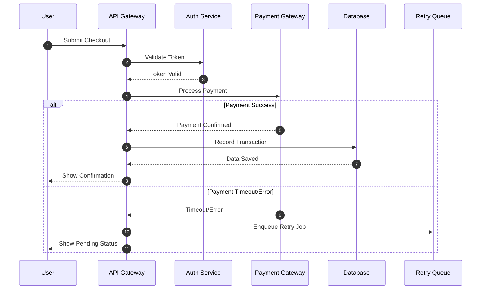

The shift from "drawing" to "defining" architecture is not just a tooling preference. It is a fundamental upgrade in how architects communicate technical logic.

If you are still dragging boxes and manually realigning arrows, you are spending energy on presentation mechanics instead of architecture decisions.

This is why the Mermaid + AI workflow is one of the most practical ways to work in an **Architecture-as-Code** model.

## Stop Drawing, Start Defining

Traditional diagramming tools are coordinate-first. Once a box is at $(x, y)$, adding a new step often means rearranging the entire canvas.

Mermaid is relationship-first. You define intent:

`A --> B`

The renderer handles spacing and alignment automatically. That changes your focus from pixel management to design quality.

## Use AI as Your Syntax Translator

The biggest adoption barrier for "as-code" workflows is usually syntax memorization. AI removes most of that friction.

Instead of remembering exact diagram grammar, you can prompt in plain language:

> "Create a Mermaid flowchart for Salesforce lead conversion: Lead enters, check duplicate, if duplicate link to existing Account, otherwise create Account and Contact, then notify sales owner."

Then review, refine, and commit the output as text.

## Mermaid as High-Quality Input to LLMs

This is the force multiplier: Mermaid is structured and machine-readable.

When you feed Mermaid back into an LLM, you can do focused architecture reviews such as:

- "Find single points of failure in this sequence."
- "Add retry and dead-letter flow after payment timeout."
- "Generate implementation notes for the integration team."

Because the model can parse structure, feedback quality is typically much better than image-based review.

## Treat Architecture Like Code

Mermaid diagrams are plain text (`.md`, `.mdx`, `.mmd`) so they fit naturally into Git workflows:

- **Diffable:** You can inspect exactly what logic changed.
- **Reviewable:** Pull requests can discuss design changes line-by-line.
- **Versioned:** No more `Final_v2_FINAL.png` chaos.

## Practical Migration Playbook (30 Days)

If you are transitioning a team, use a staged rollout:

1. **Week 1:** Document only one critical flow in Mermaid.
2. **Week 2:** Add Mermaid-based review to one PR stream.
3. **Week 3:** Introduce AI-assisted refactoring prompts for diagrams.
4. **Week 4:** Define a team standard (naming, diagram scope, review checklist).

Keep old tooling in parallel during migration. The goal is reducing friction, not forcing disruption.

## Architecture Quality Checklist for Mermaid Diagrams

Before merging, validate these points:

- Are all external dependencies explicitly shown?
- Are failure paths and retries represented?
- Are synchronous vs asynchronous boundaries clear?
- Is every decision node traceable to a business rule?
- Can an engineer implement the flow without a follow-up workshop?

If at least one answer is "no", the diagram likely needs one more iteration.

## Mermaid Usage Example

You can check how the source Mermaid code and the rendered result look like below.

### Source Code

```
sequenceDiagram
    autonumber
    participant U as User
    participant AG as API Gateway
    participant AS as Auth Service
    participant PG as Payment Gateway
    participant DB as Database
    participant Q as Retry Queue

    U->>AG: Submit Checkout
    AG->>AS: Validate Token
    AS-->>AG: Token Valid
    AG->>PG: Process Payment

    alt Payment Success
        PG-->>AG: Payment Confirmed
        AG->>DB: Record Transaction
        DB-->>AG: Data Saved
        AG-->>U: Show Confirmation
    else Payment Timeout/Error
        PG-->>AG: Timeout/Error
        AG->>Q: Enqueue Retry Job
        AG-->>U: Show Pending Status
    end
```

### Rendered Diagram



## Common Anti-Patterns to Avoid

- Overloaded "mega-diagrams" trying to explain everything at once.
- Missing non-happy-path behavior.
- Naming components by team jargon instead of function.
- Treating diagrams as static deliverables instead of living design assets.

## The Manual Pixel-Pushing Era Is Over

The architect’s job is to solve complex problems and communicate solutions clearly.

With Architecture-as-Code, diagrams become a living interface between your design intent, your engineering process, and AI-assisted iteration. You spend less time moving boxes and more time making better architecture decisions.