Moving Data 360 from a sandbox to production is not just a metadata promotion exercise. It is an operating model decision.

Data 360 sits in the middle of the customer experience stack, which means a bad release can affect unification, segmentation, activation, and downstream automation in the same way a broken application release affects a customer-facing product. That is why environment strategy, release governance, and deployment automation need to be designed together.

The main idea is simple: define clean environment boundaries, promote metadata through controlled release paths, and use Data Kits plus APIs wherever you need repeatability.

## 1. Environment Strategy First

A major pitfall in enterprise implementations is treating Data 360 as an isolated sandbox. **Each Data 360 environment is fundamentally an integrated environment**. Without live upstream and downstream connections, you cannot fully validate your architectural assumptions.

When building out your environment strategy, keep these strict technical parameters in mind:

- **CRM Mirroring:** Your Data 360 sandbox pipeline should closely mirror the environment structure of your Salesforce CRM to utilize Out-Of-The-Box (OOTB) connectors natively.
- **The "No-Credential" Rule:** When components are promoted to higher environments, integrations are migrated without credentials. You must manually reactivate and authenticate connections in each target environment.
- **Credit Consumption:** Data 360 sandboxes are not free playgrounds; they consume processing credits at **80% of the production rate**. This must be carefully factored into your performance and stress testing budgets.
- **Data Synchronization:** Test data must match accurately across all integrated environments. If your external test environments contain mismatched customer IDs compared to your CRM sandboxes, your Identity Resolution rules will fail to produce a clean, unified individual.

## 2. What Belongs in a Release Package

A Data 360 release should be built around the smallest stable unit of change.

In practice, that means grouping the metadata required to deliver a business outcome, not simply copying everything related to the platform.

Typical release content includes:

- Data Streams and related Data Lake Objects.
- Source Data Lake Objects, Data Transforms and target Data Lake Objects.
- Data Lake Objects and their mappings to respective Data Model Objects.
- Calculated Insights.
- Segments and related Activations.
- Identity Resolution or profile-related configuration.

That is where Data Kits become essential. You should not deploy any component in Data 360 without adding it to a Data Kit first, because you can otherwise break underlying processes that are happening in the backend and are not visible to admins.

Data Kits can also be added to packages, either managed or unmanaged. In this post, I'm focusing only on the Data Kit-based release pattern. If you want to learn more about Data 360 packaging workflow, please check the official Salesforce Developer Guide about [Packages and Data Kits](https://developer.salesforce.com/docs/data/data-cloud-dev/guide/packages-data-kits.html).

## 3. Data Kits as the Release Boundary

A Data Kit is the practical bridge between configuration work and controlled deployment.

You can use it to:

- create a release container,
- add or remove the relevant components,
- inspect the dependencies,
- and deploy or undeploy components in a controlled sequence.

The relevant API operations expose that lifecycle directly:

- `GET /ssot/data-kits`
- `POST /ssot/data-kits`
- `GET /ssot/data-kits/available-components`
-- `PATCH /ssot/data-kits/&#123;dataKitDevName&#125;`
-- `POST /ssot/data-kits/&#123;dataKitDevName&#125;`
-- `GET /ssot/data-kits/&#123;dataKitDevName&#125;/manifest`
-- `POST /ssot/data-kits/&#123;dataKitName&#125;/undeploy`
-- `GET /ssot/data-kits/&#123;dataKitName&#125;/components/&#123;componentName&#125;/dependencies`
-- `GET /ssot/data-kits/&#123;dataKitName&#125;/components/&#123;componentName&#125;/deployment-status`

## 4. Manual Release Flow

For teams that are still operating with some human approval and UI-driven promotion, the manual deployment pattern is straightforward.

```mermaid
flowchart LR
    A[Create Data Kit<br/>POST /ssot/data-kits] --> B[Add Components to Data Kit<br/>PATCH /ssot/data-kits/&#123;dataKitDevName&#125;]
    B --> C[Get Manifest<br/>GET /ssot/data-kits/&#123;dataKitDevName&#125;/manifest]
    C --> D[Review Dependencies<br/>GET /ssot/data-kits/&#123;dataKitName&#125;/components/&#123;componentName&#125;/dependencies]
    D --> E[Deploy from UI<br/>POST /ssot/data-kits/&#123;dataKitDevName&#125;]
    E --> F[Track Deployment Status<br/>GET /ssot/data-kits/&#123;dataKitName&#125;/components/&#123;componentName&#125;/deployment-status]
    F --> G[Undeploy if Needed<br/>POST /ssot/data-kits/&#123;dataKitName&#125;/undeploy]
```

This is the right flow when a release manager or architect needs a final human checkpoint before production.

The manual model works best when:

- the release frequency is low to moderate,
- the team is still validating the operational model,
- or business stakeholders want explicit sign-off before deployment.

## 5. Automated Release Flow

Once the process is stable, the release path should move into source control and CI/CD.

```mermaid
flowchart TB
    subgraph Build[1. Assemble Release]
        A[Create Data Kit<br/>POST /ssot/data-kits]
        B[Get Available Components<br/>GET /ssot/data-kits/available-components]
        C[Add or Update Components<br/>PATCH /ssot/data-kits/&#123;dataKitDevName&#125;]
        D[Get Manifest<br/>GET /ssot/data-kits/&#123;dataKitDevName&#125;/manifest]
        A --> B --> C --> D
    end

    subgraph SourceControl[2. Version and Validate]
        E[Store Manifest and Metadata in Git]
        F[Run Automated Checks]
        G[Approval Gate]
        E --> F --> G
    end

    subgraph Deploy[3. Promote and Monitor]
        H[Deploy Data Kit<br/>POST /ssot/data-kits/&#123;dataKitDevName&#125;]
        I[Check Component Status<br/>GET /ssot/data-kits/&#123;dataKitName&#125;/components/&#123;componentName&#125;/deployment-status]
        J[Rollback or Undeploy<br/>POST /ssot/data-kits/&#123;dataKitName&#125;/undeploy]
        H --> I --> J
    end

    D --> E
    G --> H
```

This pattern is better for teams that want reproducibility, auditability, and faster release cadence.

The key advantages are:

- repeatable packaging,
- traceable change history,
- lower manual error rate,
- and a clear path to rollback when deployment status is not clean.

## 6. Operational Guidance for Real Teams

The production-ready version of this model is not just about tooling. It is about discipline.

- Make release content explicit and reviewable.
- Inspect dependencies before promotion.
- Use the manifest as the contract for what is being moved.
- Monitor deployment status instead of assuming success.
- Keep a formal undeploy path for partial failures and rollback drills.

If you have multiple teams working in parallel, the safest pattern is to standardize component ownership and release windows so that Data Kits do not become a collision point between platform teams and implementation teams.

## 7. Suggested Rollout Sequence

If you are introducing this model into an existing program, use a phased approach:

1. Standardize environment naming, access, and release boundaries.
2. Create one Data Kit per business capability or release train.
3. Prove the manual flow first and document the operational checkpoints.
4. Automate manifest retrieval, validation, and deployment in CI/CD.
5. Add deployment status monitoring and rollback handling before broad adoption.

That order minimizes risk while still moving the team toward a proper delivery pipeline.

## Conclusion

Data 360 needs the same engineering rigor you would apply to any critical platform release in an integrated environment.

If you define environments clearly, package changes with Data Kits, and use the API surface to retrieve, validate, and deploy components, you get a release process that is both safer and faster. Manual deployment still has a place, but the long-term target should be API-driven automation with clear approval gates and rollback controls.

That is the difference between ad hoc configuration and a production-ready DevOps practice.