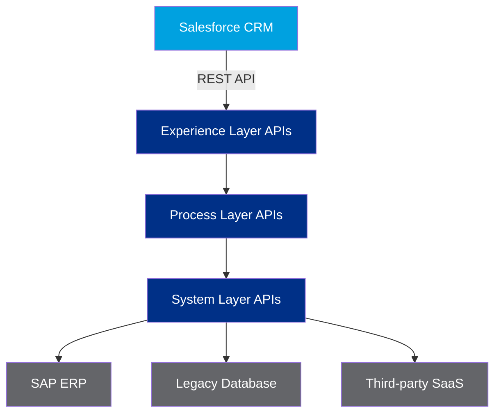
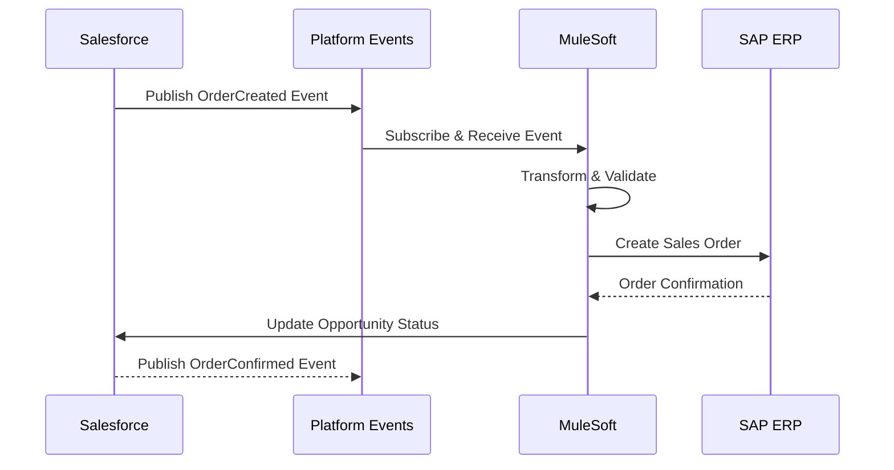

## What is the fastest way to scale Salesforce integrations?

The fastest scalable approach is an API-led architecture that separates system, process, and experience responsibilities.

Building scalable integrations between Salesforce and enterprise systems is one of the most critical challenges Solution Architects face. In this article, I'll walk through the architecture decisions I've made on several large-scale MuleSoft implementations.

## How does the API-led connectivity model work?

API-led connectivity works by isolating backend access, business orchestration, and consumer-specific APIs into separate layers.

MuleSoft's API-led connectivity model organizes APIs into three layers:



### What belongs in the system layer?

The system layer should contain stable backend connectors and minimal transformation logic.

Direct connections to backend systems with minimal transformation logic.

### What belongs in the process layer?

The process layer should implement orchestration and business transformations reusable across channels.

Business logic, orchestration, and data transformation live here.

### What belongs in the experience layer?

The experience layer should expose API shapes tailored to each consuming channel.

Tailored APIs for specific consumer needs (Salesforce, mobile, web).

## What does a Salesforce-to-SAP integration configuration look like?

The following example shows connector setup, authentication, and field mapping rules for a production pattern.

Here's a sample MuleSoft API configuration for a Salesforce-to-SAP integration:

```yaml
# mulesoft-api-config.yaml
apiVersion: v1
kind: ApiConfiguration
metadata:
  name: salesforce-sap-integration
  environment: production
  
spec:
  connector:
    type: salesforce
    version: "61.0"
    authentication:
      type: oauth2-jwt-bearer
      clientId: "${sfdc.client.id}"
      privateKey: "${sfdc.private.key}"
      
  dataMapping:
    sourceObject: "Opportunity"
    targetSystem: "SAP_S4HANA"
    fields:
      - source: "Name"
        target: "VBAK-VBELN"
        transform: "truncate(40)"
      - source: "Amount"
        target: "VBAP-NETWR"
        transform: "formatDecimal(2)"
      - source: "CloseDate"
        target: "VBAK-AUDAT"
        transform: "formatDate('yyyyMMdd')"
        
  errorHandling:
    retryPolicy:
      maxRetries: 3
      backoffInterval: 5000
    deadLetterQueue: "sfdc-sap-dlq"
    alertEmail: "integration-team@company.com"
    
  monitoring:
    metricsEnabled: true
    loggingLevel: INFO
    tracingEnabled: true
```

## Querying Salesforce Data for Integration

When building integration queries, efficient SOQL is essential:

```sql
-- Query Opportunities with related Account and Contact data
-- for batch integration processing
SELECT 
    o.Id,
    o.Name,
    o.Amount,
    o.CloseDate,
    o.StageName,
    o.Probability,
    a.Id AS AccountId,
    a.Name AS AccountName,
    a.BillingCountry,
    c.Id AS PrimaryContactId,
    c.Email AS PrimaryContactEmail
FROM Opportunity o
JOIN Account a ON o.AccountId = a.Id
LEFT JOIN Contact c ON c.Id = (
    SELECT ContactId 
    FROM OpportunityContactRole 
    WHERE OpportunityId = o.Id 
    AND IsPrimary = true 
    LIMIT 1
)
WHERE o.LastModifiedDate >= :lastRunDate
    AND o.StageName NOT IN ('Closed Lost')
    AND o.IsDeleted = false
ORDER BY o.LastModifiedDate ASC
LIMIT 200
```

## Event-Driven Architecture Pattern

For high-volume integrations, consider an event-driven approach:



## Best Practices

1. **Idempotency**: Design all integration APIs to be idempotent — processing the same message multiple times should produce the same result.
2. **Circuit Breaker Pattern**: Implement circuit breakers to prevent cascade failures.
3. **Correlation IDs**: Track every transaction end-to-end with a correlation ID.
4. **Schema Validation**: Always validate incoming payloads against schemas before processing.

## Conclusion

A well-architected MuleSoft integration layer provides the flexibility and resilience enterprise Salesforce deployments need. By following API-led connectivity principles and implementing proper error handling, you can build integrations that scale with your business.
