Form handlers in Marketing Cloud Next are a powerful way to capture data from forms that live outside Salesforce. The most reliable implementation pattern is to process submissions server-side instead of posting directly from the browser.

This approach gives us three critical advantages:

- We keep all credentials off the client.
- We validate and normalize payloads before they reach Salesforce.
- We can add observability (request IDs, logs, retry logic) for troubleshooting.

In this guide, I’ll walk through an end-to-end implementation using a React frontend and a Node.js backend that submits to a Marketing Cloud Next Form Handler.

## Architecture Overview

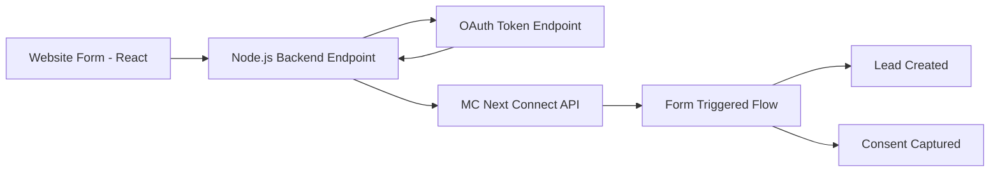

## Prerequisite: Add External Domain to CORS Allowlist

Before we're able to process forms from external websites, we need to add our domain to the CORS (Cross-Origin Resource Sharing)allowlist in Salesforce.

To do that, we simply need to navigate to **Setup → CORS → New** and add our domain. To enable form handling not only from our the top-level domain but also all subdomains, we can use a wildcard, e.g. https://*.modrzejewski.it.

## Step 1: Configure Form Handler and Flow in Marketing Cloud Next

In Salesforce:

1. Go to **Marketing app → Content → "Our Workspace Name" → Add → Content → Form Handler**.
2. Create a new handler and bind it to the target Data Source, i.e. Salesforce object (in our case it'll be Lead).
3. Map incoming fields to Salesforce object fields (example mapping for Lead below).
4. Add at least one URL (either for success or failure) in the "Submission Redirect". The user won't be redirected there as our code fully handles what happens after the submission but without this URL, we cannot save and publish the form handler.
5. Attach a flow that handles the business logic (in our case, it creates a new Lead and captures consent).
6. Save and publish the form handler (it automatically activates the attached flow).
7. Copy the **Content Key generated by Marketing Cloud** (we will use it in frontend `id` and backend config).

### Form Handler Field Mapping

**Required Fields**
- `last_name` → Last Name
- `created_date` → Created Date
- `last_modified_date` → Last Modified Date
- `status` → Status

**Additional Standard Field**
- `first_name` → First Name
- `email` → Email

**Additional Custom Field**
- `consent_email` → Email Consent

Remember that to process via a form handler a custom field (like our consent_email status), we need to first add it to the Salesforce object, e.g. via Object Manager.

Another thing to keep in mind is that the system won't allow you to save and publish the form handler without specifying at least one URL in the Submission Redirect section. You can use any URL you won't (e.g. google.com) and put it either in Success Page URL or Failure Page URL field - it won't be triggered nor used in this scenario as the server-side code handles the redirection logic.

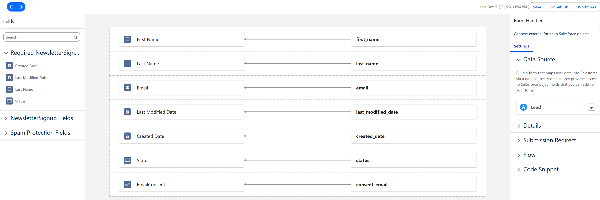

### Flow Configuration

Since our form is supposed to only capture new leads with new consents, we need to add a bit of logic to avoid overwriting previously captured data. To do that, on form submission we'll check for existing Leads based on the incoming email address. We'll only create new Lead and marketing consents if there is no Lead with this email address.

To capture the marketing consent, we'll use the OOTB Consent Request action provided by Marketing Cloud Next.

The target configuration can be found in the screenshots below.

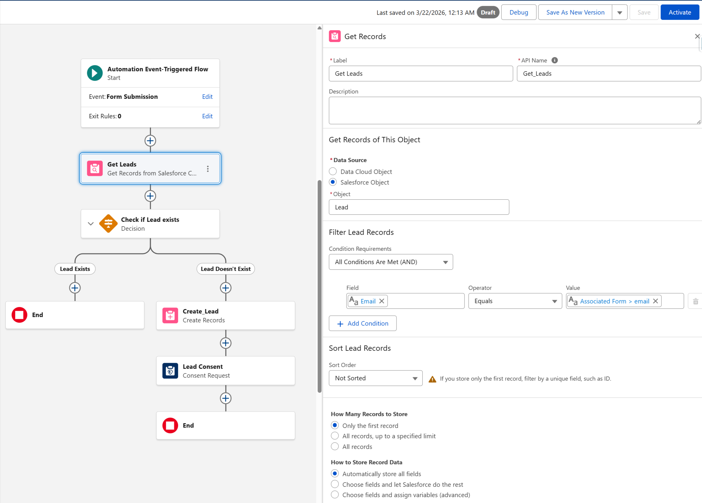

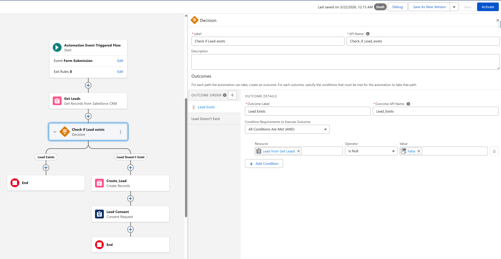

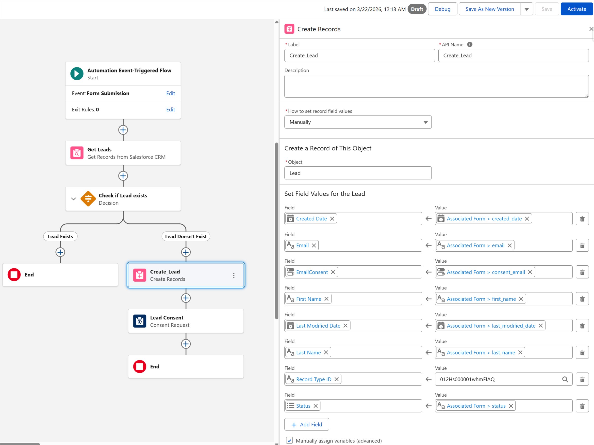

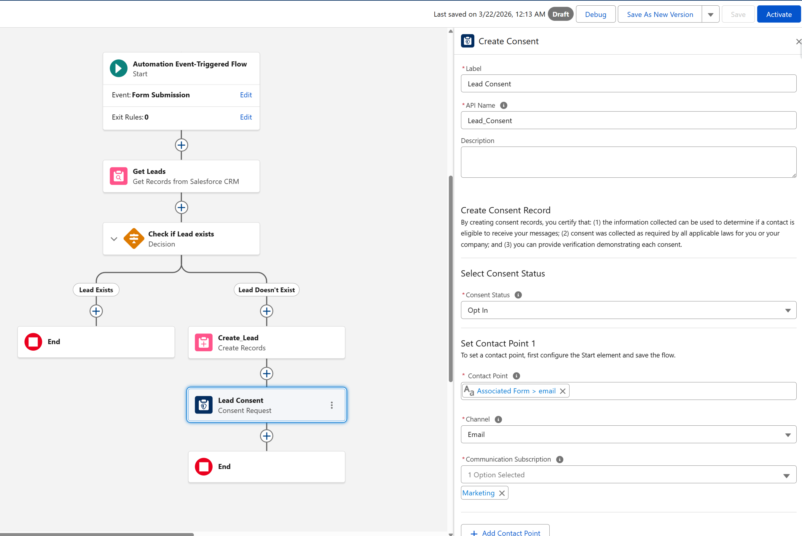

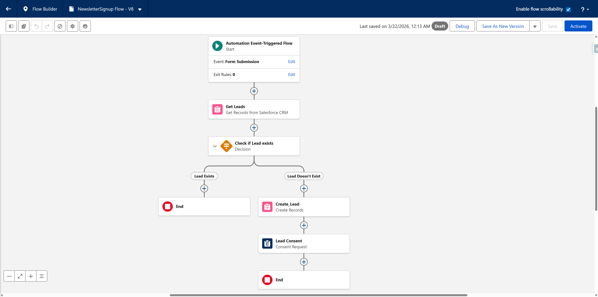

## Step 2: Set Up External Client App (OAuth Client Credentials)

To call the Marketing Cloud Next Connect API from backend code, we need to configure an External Client App. For the sake of our example implementation, we'll be using the OAuth client credentials flow.

Since client credentials flow runs in a specific integration user's context, we need to first create a dedicated user with API permissions.

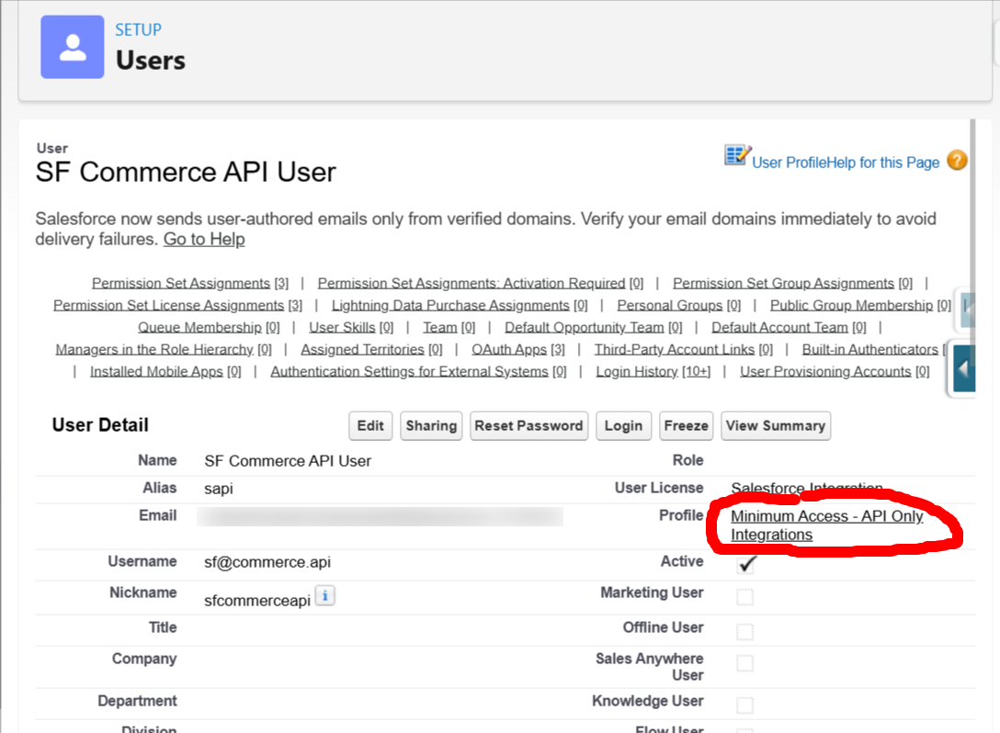

To configure the External Client App, we need to go to **Setup → External Client App Manager → New External Client App**. In the "Policies" tab, after adding required info (name of the app, email), we need to select the **Enable Client Credentials Flow** checkbox and enter the username of the integration user we created. We don't need to change anything in the **App Authorization** section.

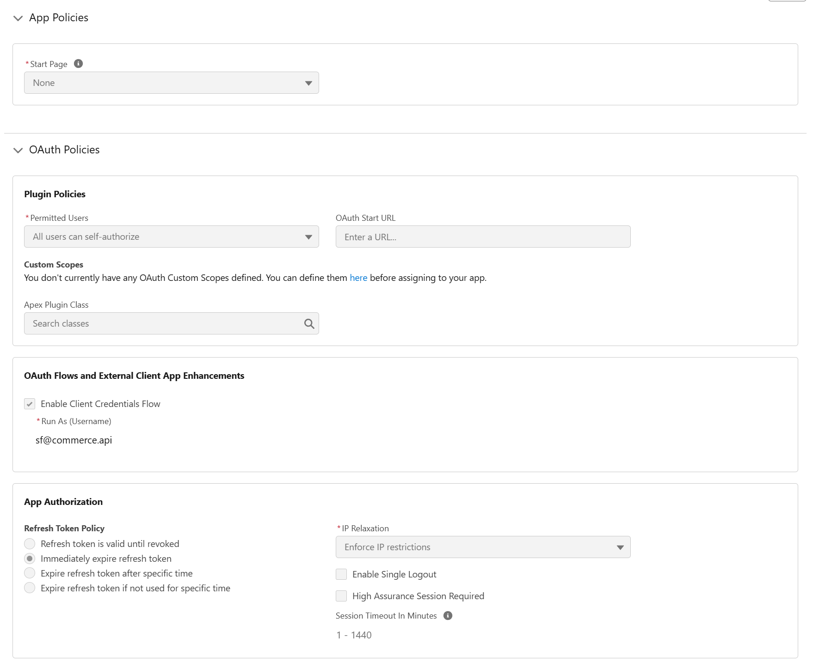

In the next tab ("Settings"), we need to configure the:
- callback URL - for the client credentials flow we can basically use whatever we like in this slot
- OAuth scopes for the app - as we want to expose as minimum as possible, we only select "api" scope
- **Enable Client Credentials Flow** checkbox - simply tick it

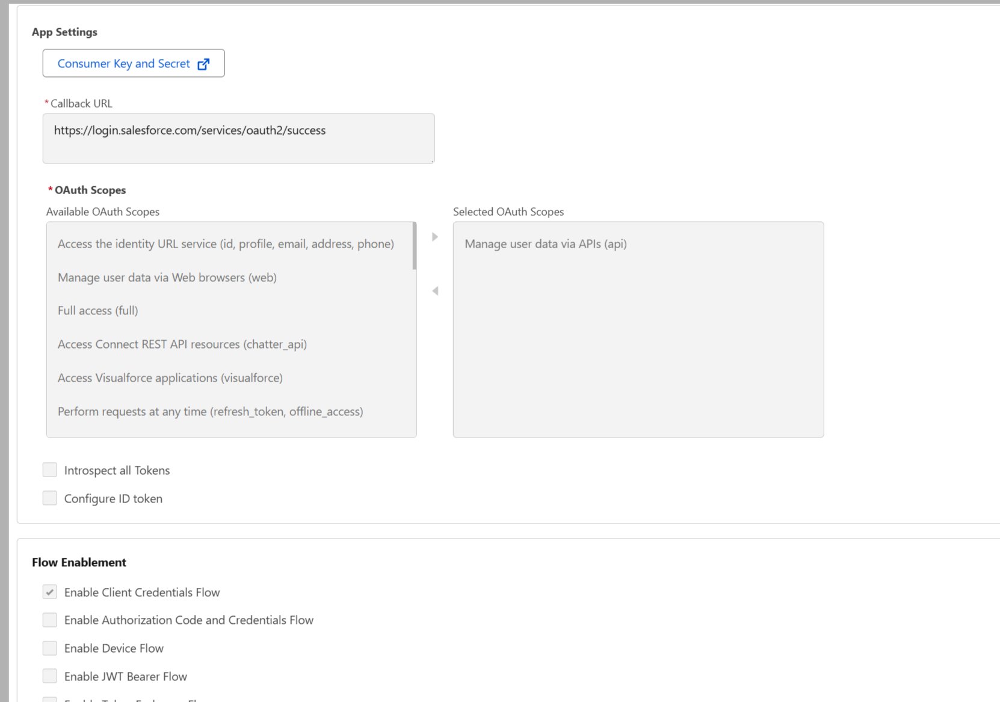

After we enable the app, in the **Settings → OAuth Settings" section, we need to click the "Consumer Key and Secret" button. After entering a verification code sent to our email, we can copy the generated client ID and secret.

## Step 3: Build the Form Frontend

Since our Salesforce org is now ready to process our form, we can start building the code. Our frontend should collect user input and send only business fields to our backend endpoint. The backend can enrich the payload (timestamps, request IDs, and defaults).

In our example, for simplicity, we're not using any honeypot fields or CAPTCHA. In the production environment, it would serve as an additional layer of protection from bots in our form.

### React Code

```tsx
import { FormEvent, useMemo, useState } from 'react';

type SubscribePayload = {
  firstName: string;
  lastName: string;
  email: string;
  consentEmail: boolean;
};

export default function NewsletterForm() {
  const [firstName, setFirstName] = useState('');
  const [lastName, setLastName] = useState('');
  const [email, setEmail] = useState('');
  const [consentEmail, setConsentEmail] = useState(false);
  const [loading, setLoading] = useState(false);
  const [message, setMessage] = useState<string | null>(null);

  const isValid = useMemo(() => {
    return (
      firstName.trim().length > 0 &&
      lastName.trim().length > 0 &&
      email.includes('@') &&
      consentEmail
    );
  }, [firstName, lastName, email, consentEmail]);

  const handleSubmit = async (event: FormEvent<HTMLFormElement>) => {
    event.preventDefault();
    setMessage(null);

    if (!isValid) {
      setMessage('Please complete all required fields and consent.');
      return;
    }

    const payload: SubscribePayload = {
      firstName: firstName.trim(),
      lastName: lastName.trim(),
      email: email.trim().toLowerCase(),
      consentEmail,
    };

    try {
      setLoading(true);
      const response = await fetch('/api/newsletter/subscribe', {
        method: 'POST',
        headers: { 'Content-Type': 'application/json' },
        body: JSON.stringify(payload),
      });

      const result = await response.json();

      if (!response.ok) {
        throw new Error(result?.detail || 'Subscription failed.');
      }

      setMessage('Success! Please check your inbox for next steps.');
      setFirstName('');
      setLastName('');
      setEmail('');
      setConsentEmail(false);
    } catch (error) {
      setMessage(error instanceof Error ? error.message : 'Unexpected error.');
    } finally {
      setLoading(false);
    }
  };

  return (
    <form onSubmit={handleSubmit} className="space-y-4">
      <input
        name="first_name"
        value={firstName}
        onChange={(e) => setFirstName(e.target.value)}
        placeholder="First name"
        required
      />

      <input
        name="last_name"
        value={lastName}
        onChange={(e) => setLastName(e.target.value)}
        placeholder="Last name"
        required
      />

      <input
        type="email"
        name="email"
        value={email}
        onChange={(e) => setEmail(e.target.value)}
        placeholder="Email"
        required
      />

      <label>
        <input
          type="checkbox"
          name="consent_email"
          checked={consentEmail}
          onChange={(e) => setConsentEmail(e.target.checked)}
          required
        />
        I consent to receive marketing emails.
      </label>

      <button type="submit" disabled={loading || !isValid}>
        {loading ? 'Submitting...' : 'Subscribe'}
      </button>

      {message && <p>{message}</p>}
    </form>
  );
}
```

### Final Form

With some additional styling, our form should look somewhat like in the screenshot below. Please note that for the testing purposes I added also an additional container that will display the payload. 

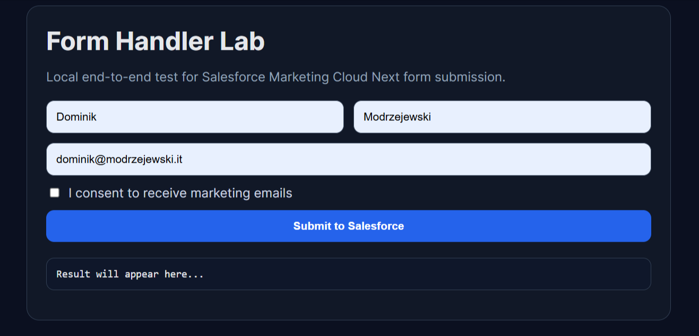

## Step 4: Process Submission on Node.js Backend

Below is a hardened Express route implementation with:

- strict required configuration checks,
- input validation,
- OAuth token acquisition,
- MC Next submission,
- request correlation via `uniqueId`.

Environment variables used on the backend:

- `SF_INSTANCE_URL`
- `SF_CLIENT_ID`
- `SF_CLIENT_SECRET`
- `SF_FORM_ID` (Content Key generated by Marketing Cloud in Step 1)

```ts
import express, { Request, Response } from 'express';
import crypto from 'node:crypto';

const router = express.Router();

const {
  SF_INSTANCE_URL = '',
  SF_CLIENT_ID = '',
  SF_CLIENT_SECRET = '',
  SF_FORM_ID = '',
} = process.env;

function assertConfig(): string[] {
  const missing: string[] = [];
  if (!SF_INSTANCE_URL) missing.push('SF_INSTANCE_URL');
  if (!SF_CLIENT_ID) missing.push('SF_CLIENT_ID');
  if (!SF_CLIENT_SECRET) missing.push('SF_CLIENT_SECRET');
  if (!SF_FORM_ID) missing.push('SF_FORM_ID');
  return missing;
}

function toSalesforceDateTime(value: Date): string {
  return value.toISOString().replace('Z', '+0000');
}

function parseBoolean(value: unknown): boolean {
  if (typeof value === 'boolean') return value;
  if (typeof value === 'string') return value.toLowerCase() === 'true';
  return false;
}

type RequestBody = {
  firstName?: string;
  lastName?: string;
  email?: string;
  consentEmail?: boolean | string;
};

router.post('/api/newsletter/subscribe', async (req: Request, res: Response) => {
  const missingConfig = assertConfig();
  if (missingConfig.length > 0) {
    return res.status(500).json({
      detail: 'Salesforce newsletter integration is not configured.',
      missing: missingConfig,
    });
  }

  const body = req.body as RequestBody;
  const firstName = (body.firstName || '').trim();
  const lastName = (body.lastName || '').trim();
  const email = (body.email || '').trim().toLowerCase();
  const consentEmail = parseBoolean(body.consentEmail);

  if (!firstName || !lastName || !email) {
    return res.status(400).json({ detail: 'firstName, lastName and email are required.' });
  }

  if (!consentEmail) {
    return res.status(400).json({ detail: 'Consent is required.' });
  }

  const uniqueId = crypto.randomUUID();
  const now = toSalesforceDateTime(new Date());

  const formData = {
    first_name: firstName,
    last_name: lastName,
    email,
    consent_email: true,
    created_date: now,
    last_modified_date: now,
    status: 'New',
  };

  try {
    const tokenResponse = await fetch(`${SF_INSTANCE_URL}/services/oauth2/token`, {
      method: 'POST',
      headers: { 'Content-Type': 'application/x-www-form-urlencoded' },
      body: new URLSearchParams({
        grant_type: 'client_credentials',
        client_id: SF_CLIENT_ID,
        client_secret: SF_CLIENT_SECRET,
      }),
    });

    const tokenJson = await tokenResponse.json();
    const accessToken = tokenJson?.access_token;

    if (!tokenResponse.ok || !accessToken) {
      return res.status(502).json({
        detail: 'Salesforce token request failed.',
        status: tokenResponse.status,
      });
    }

    const submitUrl = `${SF_INSTANCE_URL}/services/data/v65.0/connect/form-handler/${SF_FORM_ID}/submit`;
    const submitResponse = await fetch(submitUrl, {
      method: 'POST',
      headers: {
        'Content-Type': 'application/json',
        Authorization: `Bearer ${accessToken}`,
      },
      body: JSON.stringify({
        formData,
        uniqueId,
      }),
    });

    const submitJson = await submitResponse.json().catch(() => ({}));

    if (!submitResponse.ok) {
      return res.status(502).json({
        detail: 'Salesforce form submission failed.',
        status: submitResponse.status,
        uniqueId,
      });
    }

    return res.status(200).json({
      ok: true,
      uniqueId,
      salesforceResponse: submitJson,
    });
  } catch (error) {
    return res.status(502).json({
      detail: 'Salesforce integration error.',
      error: error instanceof Error ? error.message : 'Unknown error',
      uniqueId,
    });
  }
});

export default router;
```

### Successful Call

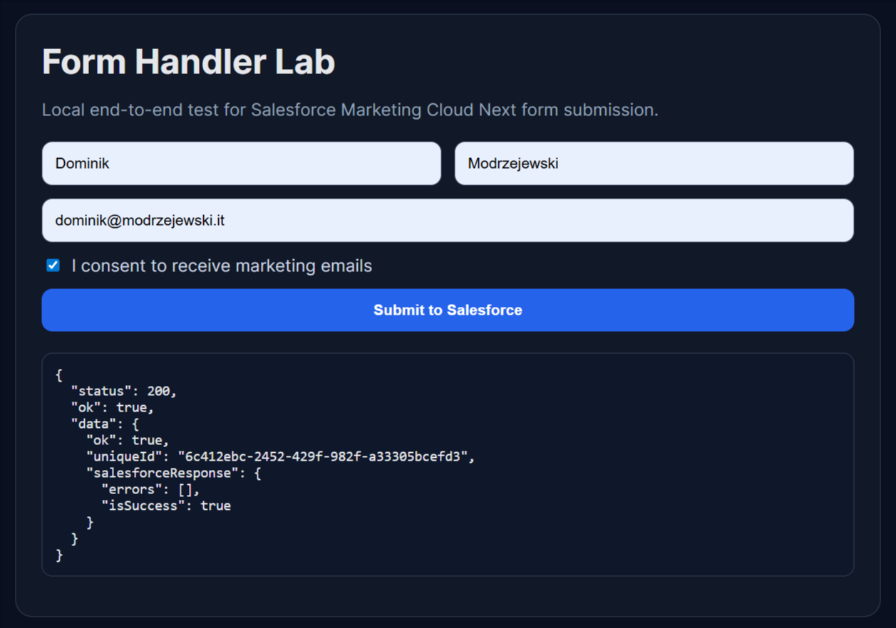

## Step 5: Validate End-to-End Outcome in Salesforce

After submission, we can validate in Salesforce:

1. Lead exists with expected field values.
2. Consent Request action was executed in flow and resulted in creation of opt-in for subscription we selected.

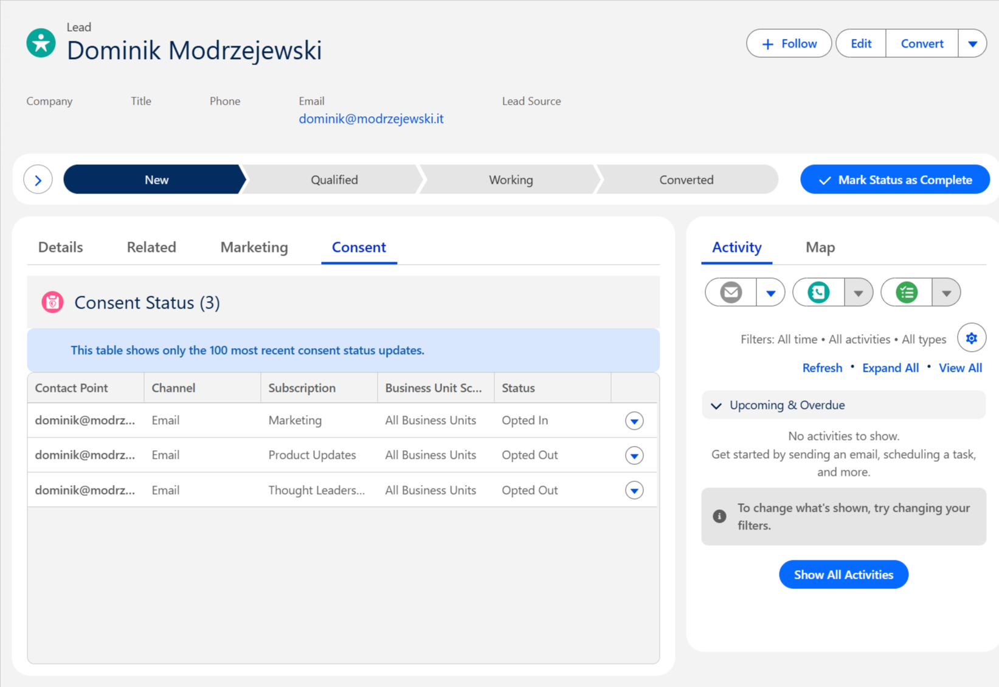

## Common Pitfalls and Hardening Tips

- **Field name mismatch:** `formData` keys must align with Form Handler mapping.
- **Scope/permission errors:** check integration user profile and connected app scopes.
- **Time format issues:** normalize datetime formats to YYYY-MM-DDTHH:mm:ss.sssZ (ISO 8601 format) before submit.
- **Leaky errors:** return safe client messages; keep verbose diagnostics in server logs.

## Final Thoughts

Server-side form processing is the cleanest way to integrate external forms with Marketing Cloud Next while maintaining security, scalability and operational control. Once this foundation is in place, we can easily expand and adjust the business logic - both in the flow attached to the form handler as well as in our frontend and backend code.
